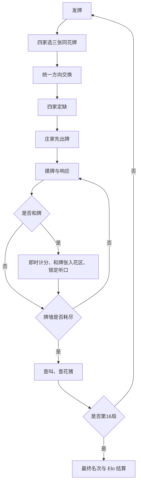

# 川麻血流换三张设计稿

日期：2026-10-05。状态：当前实现与匹配场设计。规则快照版本：3。

本稿描述四人个人玩法，供产品、客户端、服务端与测试共同使用。

## 1. 玩法与开局

| 项目 | 当前设计 |
| --- | --- |
| 人数与牌组 | 四人；万、筒、条各 1–9，每张四枚，共 108 张，无字牌、花牌 |
| 局制 | 自定义支持 4、8、12、16 局；Elo 匹配固定全庄战 16 局 |
| 初始手牌 | 庄家 14 张，其他玩家各 13 张 |
| 换牌 | 四家各选三张同花色、实际持有的牌；所有人选定后同时交换 |
| 交换方向 | 本局统一取顺时针、逆时针或对家；由本局种子派生，牌谱保存方向 |
| 定缺 | 收到交换牌后，四家独立选择万、筒或条中的一个花色 |
| 定缺约束 | 持有定缺牌时优先打出；定缺花色不可碰、杠、和，副露也参与检查 |
| 庄家起手 | 换牌、定缺阶段不能和牌；庄家必须先打一张，无天和 |
| 吃与碰杠 | 不可吃；首次和牌前允许碰、点杠、暗杠、加杠 |
| 起和条件 | 四面子加一对将，或七对；缺至少一门并符合所选定缺，无额外起和分门槛 |

换三张与定缺共用阶段截止时间机制：开局窗口至少 10 秒。未提交、掉线或持续提交非法动作的玩家，由服务端在截止后自动选择合法牌或缺门，随后继续开局。已提交玩家不能自行撤销本次提交。

交换前后每家手牌张数保持 14／13／13／13，全桌牌的数量与牌墙保持不变。其他玩家在该阶段看不到选出的三张牌；开局广播仅向玩家本人发送完整暗手。

## 2. “好牌不换”的处理边界

当前正式执行四家强制交换，不提供“拒绝换牌”或“好牌免换”选项。

保存的参考材料提到：当另外两门花色各不足三张时，可以触发“好牌不换”。该说明没有定义剩余玩家的配对、方向如何变化、仅一人需要换牌时怎样处理，也没有说明玩家可以主动拒换。

因此，这条材料不能作为“任何玩家可单方面拒换”的依据，也不能据此推导“三家拒换，第四家独自换”的规则。本次保留原有强制交换，补充无人、一人、三人提交后的超时完成测试，确保不会留下无法交换的一家。

若后续纳入免换机制，需要先完整确定：资格是否由系统强制判断、是否允许合资格玩家仍选择换牌、剩余一／二／三家的交换办法、方向和随机种子的定义、客户端提示、牌谱记录与规则版本。该机制应作为明确的规则变更另行实现。

## 3. 行牌与重复和牌

首次和牌立即转移分数，和牌张移入可累积的公开花区。其余暗手继续隐藏，玩家继续参与摸牌、和牌和放铳，已和者仍支付其他人的自摸或杠分。

首次和牌后固定完整听牌集合：不能改牌、碰或点杠；普通摸牌仅摸切。暗杠和加杠必须完整保留原听口，不能只保留某一张听牌。后续和牌不再次选择定缺。

一炮多响等待所有有资格者响应，按离放铳者的距离依次结算实际选择和牌者。选择过牌者不计入赢家。自摸者或最后一位点和者的下家继续摸牌。

放弃点和后，到下一次摸牌前，不能点和不高于已放弃分值的牌；更高分点和仍可成立，自摸不受此限制。加杠可被抢，暗杠不可抢。三家或四家均已和牌时，仍继续打到牌墙耗尽。

## 4. 和牌计分

| 基础牌型 | 基础分 |
| --- | ---: |
| 基本胡 | 2 |
| 碰碰胡 | 4 |
| 七对 | 6 |
| 清一色 | 6 |
| 金钩钓 | 8 |
| 清碰 | 10 |
| 清七对 | 12 |
| 清金钩钓 | 16 |

基础牌型择使最终分数最高的成立组合，不累加互相包含的基础牌型。门清加 1，点和也计；暗杠不破门清，七对不加门清。断幺九加 1，手牌及副露均不得含一、九。

手牌与副露的物理牌中，每四张相同牌计一根。七对中的四张相同牌可组成两对，同时计一根。杠上花、杠上炮、抢杠、海底自摸各增加一个根倍率；末张放铳不计海底。

`和牌分 =（基础分 + 门清 + 断幺九）×（1 + 根数 + 情境根数）`

示例：门清基本胡为 3 分；同一牌型另有一根、杠上花时为 `3 × (1 + 1 + 1) = 9` 分。普通七对为 6 分，含一根时为 12 分；若同时断幺九则为 14 分。

点和由放铳者单独支付和牌分，自摸由其他三家各支付和牌分。分数直接结算，不采用标准血战的指数番或三番封顶，也不额外加“自摸一分”。

## 5. 杠分与抢杠

| 杠类型 | 即时付款 |
| --- | --- |
| 点杠 | 放杠者付 3 分 |
| 加杠 | 其他三家各付 1 分 |
| 暗杠 | 其他三家各付 2 分 |

杠分即时转移，胡牌中的根倍率另算。付款者之前取得的杠分不会再次叠加到其和牌付款中。

加杠被抢时，恢复为原碰，撤销该次加杠收益；之前已完成的其他杠保留。退款仅执行一次，广播及牌谱都记录退款。换三张不采用血战的杠上炮杠分转移。

## 6. 牌墙耗尽、庄家与局间状态

所有玩家按当前手牌重新查叫，已经和过牌也重新参与判断，不以之前锁定的听口直接认定听牌。墙内没有剩余和牌张，不妨碍听牌资格。

未听牌者向每名听牌者支付其最高合法自摸可和分；仍持定缺牌、定缺副露或三门牌者为花猪，支付两倍。无听牌收款人时不转移分数，并展示“无人听牌”的状态。每次牌分转移四家合计为 0。

末张和牌先结算该次和牌，再查叫；只有查叫最终面板发出下一局准备或比赛结束入口。

首次和牌事件为单人和牌时，下一局由该玩家坐庄；首次事件一炮多响时由放铳者坐庄；无人和牌则原庄继续。局数按已完成手数推进，不因连庄增加 Elo 全庄战的总局数。每局清空锁手、听口、花区、过和限制、杠记录和首次和牌事件，保留全场累计分数。

## 7. Elo 匹配场

| 项目 | 参数与行为 |
| --- | --- |
| 显示名 | 川麻血流换三张 · Elo 匹配 · 全庄战 |
| 队列 ID | `sichuan_xueliu_exchange_elo_quanzhuang` |
| 游戏规则／子规则 | `sichuan` ／ `sichuan/xueliu_exchange` |
| 独立评分池 | `sichuan_xueliu_exchange`；血战仍使用 `sichuan` |
| 人数与局制 | 满四人开局；16 局；不补机器人 |
| 排队方式 | 按加入顺序匹配，沿用现有 Elo 场逻辑 |
| 计时 | 出牌 5 秒，个人回合时间 20 秒；换牌、定缺至少 10 秒 |
| 辅助 | 开启番数及指针提示，开启鸣牌保护；关闭战术鸣牌、错和 |
| 初始评分 | R = 1500；K = 32，预期分母 2400 |
| 评分结果 | 根据全场最终名次与三个对手分别比较，并列按平局；累计牌分用于确定名次 |
| 低分保护 | 桌均 R 低于 1500 时使用既有保护奖励，无个人保底 |
| 数据范围 | 独立 Elo、局数、排行榜、匹配统计、匹配近期战绩 |

普通预期 `E = 1 / (1 + 10^((对手 R - 自己 R) / 2400))`。
保护偏移 `T = max(0, 1500 - 四人平均 R)`，保护预期 `E' = 1 / (1 + 10^((对手 R + T - 自己 R) / 2400))`。指数限制为 −16 至 16。

普通变化为 `(32 / 3) × Σ(S - E)`，保护奖励为 `(32 / 3) × Σ(E - E')`；胜／平／负的 S 分别为 1／0.5／0。两部分分别保留两位小数，普通变化的舍入余差由末位吸收。四人初始 R 均为 1500、顺位各不相同时，变化为 `+16、+5.33、−5.33、−16`。

结算在数据库事务中完成，同一比赛 ID 重试或并发投递不会重复加扣分。子规则不符时在写库前拒绝结算；自定义换三张不计 Elo。

## 8. 客户端、牌谱与兼容

匹配页在外层“川麻”内提供“血战到底／血流换三张”切换，血流换三张展示一张全庄战卡片。返回川麻时恢复本次运行中上次选择的玩法；切换保留正在等待的队列。排队、匹配成功提示、评分问号、玩家资料和排行榜使用完整玩法名。评分与匹配统计选择该独立池，自定义统计继续使用既有川麻分类。Elo 标题使用常规字体；完整界面设计见 [匹配页设计](../../open_mahjong_unity/Docs/RankedRules.md#匹配页设计)。

固定 UI 烘焙到 MainScene，配置数组和按钮事件保留为场景资源；运行时只更新人数、评级和队列状态。规则枚举新增项追加在末尾，保留旧场景枚举值。

新牌谱记录子规则、版本 3 规则快照、真实交换方向、换牌结果、定缺、花区和逐次和牌／杠分／退款。旧血流弃三张牌谱及旧版换三张番表继续按其快照解释，不推断成当前规则。

服务端通过 `XueliuGameState` 的换牌配置执行，使用四面子和型与独立番表；匹配建桌明确选择该状态机。客户端的听牌、算分和回放使用相同规则口径。

## 9. 分支验收矩阵

| 功能 | 关键分支 |
| --- | --- |
| 开局 | 三种交换方向、牌守恒；无人／一人／三人提交；超时自动选牌；非法、旧阶段、错动作请求 |
| 定缺 | 真实选择、超时；布尔值及旧动作编号拒绝；定缺牌、副露和花猪约束 |
| 算分 | 八种基础牌型、门清与断幺九、七对零至三根、杠根、四类情境根、非法物理牌 |
| 和后操作 | 重复自摸及点和、暗手隐藏、花区累积、锁定完整听口；允许／禁止加杠 |
| 杠 | 真实暗杠与加杠、点杠分值；抢杠恢复碰、仅退款该次、退款幂等与重连 |
| 响应 | 单响／双响／三响、过牌不计赢家、过和限制、多人均和仍续打 |
| 结束 | 末张和牌后查叫、已和者重新查叫、花猪双倍、无收款人、16 局结束、局间重置 |
| 评分 | 四人真实建桌、血战与换牌池隔离、子规则错配、并发重试一次落库、排行榜与历史筛选 |
| 客户端 | 场景引用、队列名称、初始 R、六页及 27 个场次、服务端／客户端算分和听口一致 |

本次执行结果及覆盖率详见工作区内的验证记录。功能分支测试和代码覆盖率分别统计；不将不可触达的兼容或防御分支解释为规则已经发生，也不以单一覆盖率数字代替联机验收。
